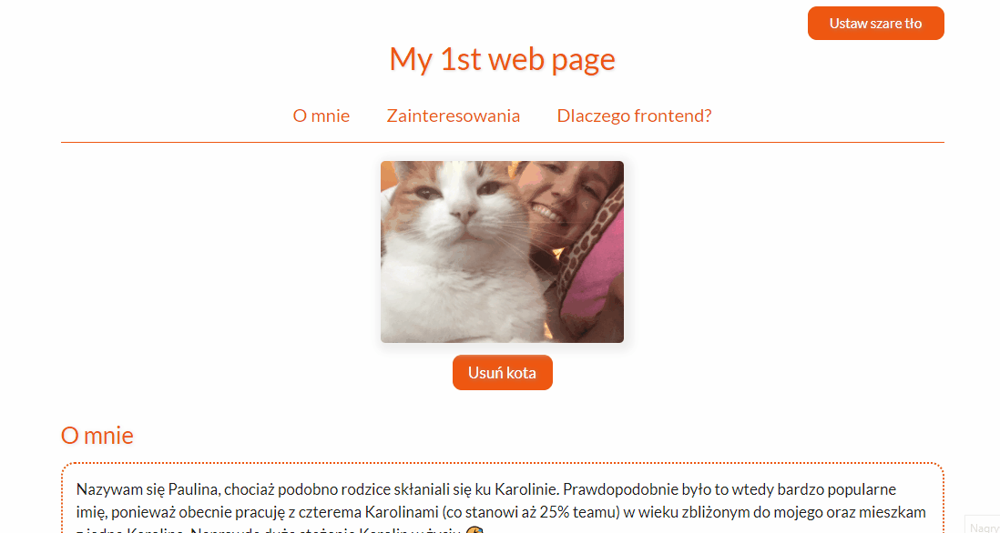

# Homepage
Welcome to my homepage!
This is the task that I'm doing as a part of a Frontend Developer course.
From this homepage you can learn a few facts about me: 
- who I am, 
- where I'm coming from,
- what I'm intrested in,
- and why I've started Frontend course.
## Demo
You can take a look at my homepage demo [here](https://paulgrym.github.io/Homepage/).
## How to use

## Technologies
- HTML
- CSS
- JavaScript
- BEM convention
- Flexbox

